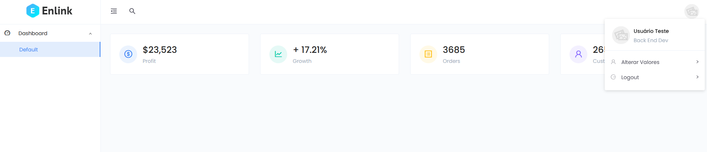
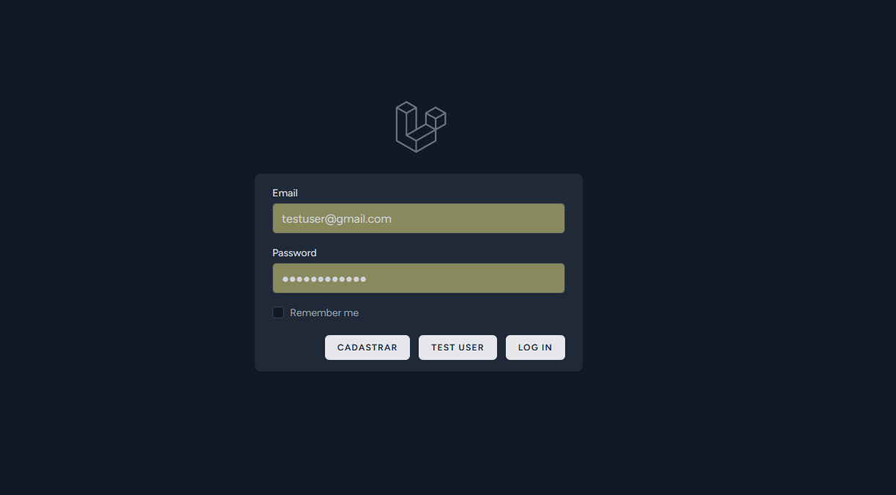

# Dashboard Laravel





> O projeto foi criado com a intenção de entender e explorar as funcionalidades do Laravel, com foco na manipulação de dados no backend utilizando um CRUD simples e objetivo.

## 💻 Pré-requisitos

Antes de começar, verifique se você atendeu aos seguintes requisitos:

* Você instalou a versão mais recente de `<node / composer>`
* Você tem uma máquina `<Windows>`.

## 🚀 Instalando <Dashboard Laravel>

Para instalar o <Dashboard Laravel>, siga estas etapas:

<Comandos de instalação>
```
- Renomear o arquivo .env.emxample para .env
- npm install
- npm run build 
- composer install
- php artisan key:generate
- php artisan serve

Com esses comandos o projeto já esta apto a ser utilizado sem o uso de um bancos de dados simulando os testes. 
Caso queira utilizar todas as funcionalidades faça a conexão a um banco de dados local.

Você pode utilizar os seguindes comandos para conexão no .env caso utilize MySQL:

- mysql -u root -p
- php artisan migrate:fresh
- php artisan test

```

## ☕ Usando <Dashboard Laravel>

Para usar <Dashboard Laravel>, siga estas etapas:

- Realize o login clicando no botão "test user" para simular o projeto sem conexão no banco de dados.
- Caso esteja utilizando a conexão com bd, cadastre-se e realize o login com a conta criada.
- Clique no ícone localizado na lateral superior direita para ter acesso ao modal de alteração e visualização dos valores armazenados no BD do usuário.


